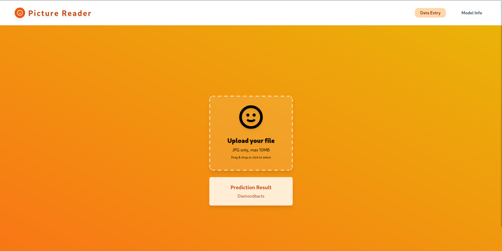
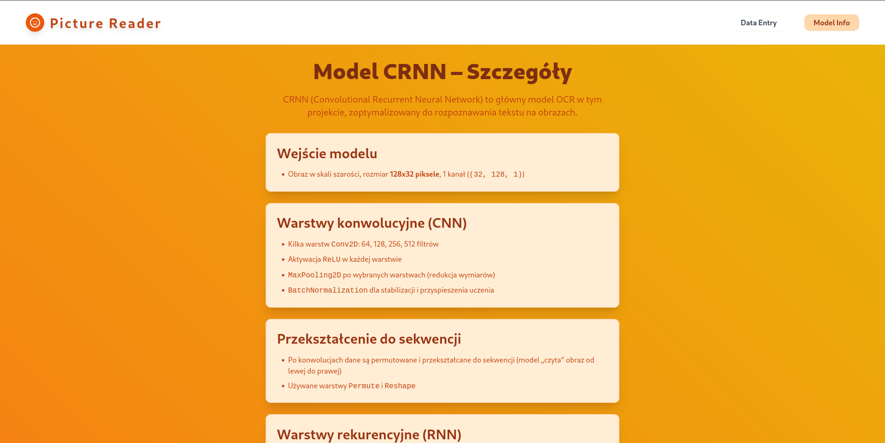

# Dokumentacja aplikacji InvoiceReader

## Opis

**InvoiceReader** to aplikacja webowa służąca do rozpoznawania tekstu (OCR) z obrazów oraz prezentacji szczegółów używanego modelu CRNN. Umożliwia użytkownikowi przesyłanie plików graficznych (JPG ) i uzyskanie predykcji tekstu, a także zapoznanie się z architekturą modelu wykorzystywanego do rozpoznawania.

## Funkcjonalności

- **Data Entry View**: Przeciągnij i upuść lub wybierz plik do rozpoznania tekstu. Wynik predykcji wyświetlany jest na stronie.
- **Model Info View**: Szczegółowy opis architektury modelu CRNN, używanego do OCR.

## Wymagania

- Node.js, npm
- Angular CLI

## Uruchomienie

1. Zainstaluj zależności:
   ```sh
   npm install
   ```
2. Uruchom aplikację developersko:
   ```sh
   ng serve
   ```
3. Otwórz w przeglądarce: [http://localhost:4200](http://localhost:4200)

## Widoki aplikacji

### Data Entry View


---

### Model Info View



---

## Struktura projektu

- `src/app/core/data-entry-view/` – komponent do przesyłania plików i wyświetlania predykcji
- `src/app/core/model-info-view/` – komponent z opisem modelu CRNN

